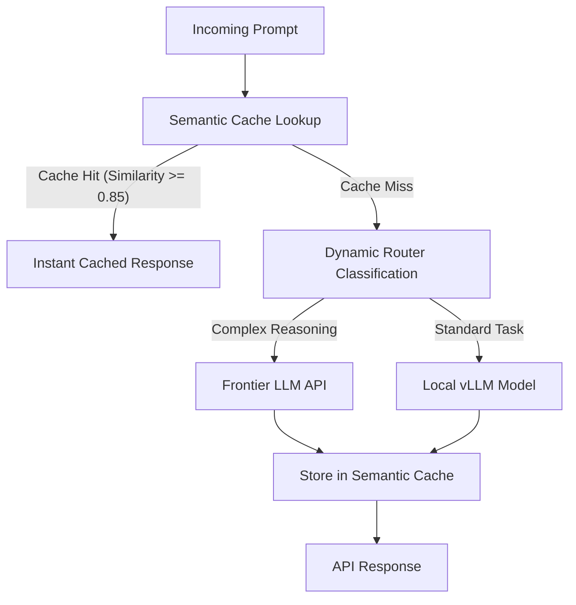

# High-Throughput LLM Gateway 

A production-grade middleware gateway designed to optimize enterprise LLM workloads. It combines semantic vector caching to bypass redundant inference calls and dynamic query routing to balance performance and cost between local open-source models and frontier APIs.

---

##  System Architecture & Workflow

Semantic Caching Layer: Computes dense vector embeddings of incoming queries and matches them against historical requests using cosine similarity, slashing response times to milliseconds.

Dynamic Router: Analyzes query complexity markers to route tasks intelligently between local and frontier models.

High-Throughput Middleware: Built with FastAPI to handle high-concurrency enterprise traffic safely.

##  Technical Stack
API Framework: FastAPI & Uvicorn for asynchronous, high-concurrency request handling.

Vector Embeddings & Similarity: Sentence-Transformers (all-MiniLM-L6-v2) and NumPy for dense vector generation and high-speed cosine similarity matching.

Data Validation & Settings: Pydantic and Pydantic-Settings for robust payload validation and environment configuration.

Networking: HTTPX for asynchronous upstream model routing calls.

